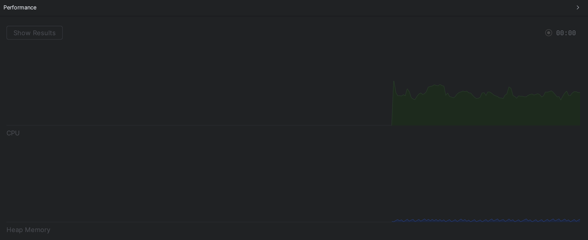

= Scalable JSON Transformation in Industrial IoT: From DOM to Stream Processing

image::images/title.jpeg[]

== Introduction

During my endeavor of bringing IT and OT together, there is one type of task that I continuously had to deal with over the last 9 years.
Especially in the MQTT world, but also when doing rest-calls to Apache IoTDB or other REST services:

Sources provide information in the form of JSON documents.
However, almost never has the source been sending data in the format that the receiving part needed.
So in the end it is always necessary to clean up and transform this data.

While the MQTT use-case usually has many devices sending smaller JSON payloads, database queries quite often send pretty large responses but a lot less frequent.

I have a long history with transforming data.
I think I started doing that with `Apache Cocoon` and in my student-job at Danet in 1999.
In those days the format of choice was `XML`.

I'll never forget when Java and with it `Cocoon` got `SAX` (Simple API for XML), which was a way of processing XML in a streaming fashion.
With SAX-based pipelines, it was possible to transform gigabyte big XML documents with only a few megabytes of RAM.
The evolution of `XSLT` processors made transforming even huge amounts of data super easy and efficient.

I never quite understood that wherever I came across systems for working with JSON data, usually the full document is parsed and kept in memory for being processed.
In the XML times, we called this method of processing data: `DOM` (Document Object Model).
And then, if you did that for anything else than keeping configuration settings in memory and a senior software developer saw it, you were usually in for a lecture on good software engineering practices.

With the emergence of alternate formats, such as `JSON`, `YAML`, `TOML`, ... however, it seems these good software engineering practices have been lost.
Or was it the emergence of cloud computing with "unlimited" availability of CPU and RAM?
I always missed that none of these really have highly mature ways to validate and transform data compared to what we had in the `XML` world with `XSLT` and `XSD`.
(Yes, there are some approaches, but compared to XSLT and XSDs, they're pretty much useless)

I was thinking: "Would it not be possible to transform `JSON` data using the tools I used with `XML`?"

Also, did I want to measure if my gut-feeling with respect to transforming JSON data was generally right.

It was, and it wasn't ... this is what this article is about.

== The Problem with the Traditional DOM Approach

While this is not that much of an issue for full-blown servers, on edge-gateways, cpu time and memory are never inexpensive or plentiful.

Most systems load JSON documents into a DOM-like structure using libraries such as Jackson.
Then they manipulate these in memory and finally serialize them back to JSON.

I think that by processing data in the form of DOMs is wasting a lot of resources, resources that could be put to a lot better use.

When it comes to really large documents, it even prevents systems from even being able to process them at all as a DOM usually consumes significantly more RAM than the source document.
But even with thousands of small documents, the CPU is highly consumed with cleaning up memory.

Just as a real-world example from the automation industry world:
Here usually hundreds to thousands of devices are present on the shop floor.
Many of these send data in some intervals.
In large installations this results in hundreds to thousands of messages being in need of processing every second.
Quite often the gateways are not able to process so many small requests, due to the overhead of needing to allocate memory and cleaning up afterward.

== Exploring Stream-Based JSON Transformation

What is stream processing?

When doing stream processing, usually an input is converted into a stream of events.
These events are emitted from a source, possibly processed by a number of interceptors, and finally consumed by a sink.

The benefit of stream processing is that the entire document doesn't need to be kept in memory.
You can also theoretically transform an indefinitely large document if your source is a continuous stream of data.

Benefits for IIoT:
Processing data in this way results in a much lower memory footprint, which comes in extremely handy on the shop floor when using edge gateways.

Challenges:
There are already some solutions in the JSON world, such as `Jackson Streaming` and `JsonIter`.
However, learning how to build transformations with these has a pretty steep learning curve.
I personally had to fight a bit with the code till I got my transformations right, and I'm actually used to the fights you usually have when building compilers.
Also is tracking down errors a lot harder.

This is definitely nothing someone used to low-code solutions will be comfortable with.

== A Different Angle: JSON → SAX → XSLT → JSON

In the past I always loved the power and expressiveness of XSLT.
I thought: "Why not transform JSON data using XSLTs?"

So I built a `Reader` and a `Writer` that parse `JSON` documents and emit `SAX` events, which allow direct manipulation or usage of `XSD schema validators` and `XSLT processors` and in the end serialize all of this back to `JSON`.

I was pretty surprised at how well this worked, and to get some idea of its performance, I decided to do some benchmarks.

Not only did I compare it with the normal DOM approach, but also with the JSON streaming options I mentioned in the previous chapter.

But what's the benefit of this approach?

The answer is clear: You can harness the power of existing tools.
Tools that now have had 25 years to be so mature, I would call them pretty much perfect.
While you can definitely use `JSONSchema` to validate your input, the expressiveness of the 2020 version still doesn't support concepts such as type inheritance.
This was particularly something that just recently bothered me quite a lot.
Thanks to the lack of such features, generated code also couldn't use type inheritance.

Generally, generating code from JSONSchemas is awful, and I had to build my own tooling.

However, using XSDs it was a breeze to auto generate even sophisticated model types in many languages.
Jackson actually having its roots in the XML world, also makes it super easy to consume these SAX streams and construct strongly typed and auto-generated models.
In this case it was easy to use Jackson as a sink for parsing directly from the SAX stream without the need to serialize it to JSON first.

When it comes to transforming data, XSLT is just beautiful.
I have never come across any other technology that makes transforming data so easy.
Also, there are loads of well-established tools that help you write, edit, test, and debug XSL transformations.

Another benefit of not having actual code to run: Deploying changes at runtime is a lot simpler.
With Java code, you usually need to compile the code first and somehow tell the classloader to use a new version of your class.
This usually gets really messy really quickly, and you're back to fighting classloader issues.

With XSLT, you reload a changed resource and start using it.

== Tooling Implementation

At first, I started implementing a JSON parser, using ANTLR4.

It turned out the default implementation parsed the entire document into an ANTLR internal tree model, which was killing my improvements.
However, you can tell ANTLR to not parse and build the tree and then emit the SAX events using the usual ANTLR Listener interfaces.
In this mode I had to extend the parser itself and make it directly emit the SAX events.
Extending my Parser to also implement the XMLReader interface made me able to use that as a SAX source.

This source emits an XML stream that contains all necessary information needed to be able to serialize it back to JSON.

One of the first big surprises for me was that it turned out that manually implementing a JSON parser was actually quite a bit more efficient.
So in the end that was the option I stuck with.

For implementing the transformation, I tried various approaches:

* Implement the transformation logic in the form of a direct SAX transformer written in Java.
* Use Apache Xalan as an XSL transformer, as this is a very mature and nicely licensed open-source solution (Apache 2.0) (no Streaming).
* Use Saxonica Saxon HE (Home Edition) as an open-source solution (no Streaming)
* Use Saxonica Saxon PE/EE (Professional Edition/Enterprise Edition) as a commercial offering that supports streaming (Also supports Schema validation).

The last part needed was a serializer to serialize the SAX stream back to JSON format, but that was actually super trivial.

== Benchmark Setup

To see how my solution compares with existing ones, I generally wanted to let it compete with the following set of tools:

* Jackson with DOM tree walking (Transformation as Code)
* Streaming approaches:
** Jackson Streaming with stream processing (Transformation as Code)
** JsonIter with stream processing (Transformation as Code)
* SAX approaches:
** Pure SAX stream processing (Transformation as Code)
** Apache Xalan (Transformation as XSLT)
** Saxonica Saxon HE (Transformation as XSLT)
** Saxonica Sacon PE/EE stream processing (Transformation as XSLT)

In general, I wanted to test two things:

* Transforming large JSON documents (hundreds of megabytes to gigabytes big)
* Transforming hundreds of thousands of smaller JSON documents (few kilobytes)

For all I defined the following JSON object structure:

```
{
  "name": "John Doe",
  "age": 30,
  "isActive": true,
  "address": {
    "street": "123 Main St",
    "city": "Anytown",
    "zipCode": "12345"
  },
  "phoneNumbers": [
    "555-1234",
    "555-5678"
  ],
  "roles": [
    {
      "name": "admin",
      "level": 5
    },
    {
      "name": "user",
      "level": 1
    }
  ],
  "settings": {
    "notifications": true,
    "theme": "dark",
    "temperature": 70.7,
    "preferences": {
      "language": "en",
      "timezone": "UTC"
    }
  },
  "tags": ["important", "personal", "work"]
}
```

The transformations that I wanted to do are:

- Convert the `age` into a `yearOfBirth` (I know it's not rock-solid just based on an age, but it's just an example).
- Add a `country` which is set to `Germany` to the address.
- Convert the `temperature` from `Fahrenheit` to `Celsius`.
- Make all `tags` uppercase.

The output was expected to look something like this:

```
{
  "name" : "John Doe",
  "yearOfBirth" : 1995,
  "isActive" : true,
  "address" : {
    "street" : "123 Main St",
    "city" : "Anytown",
    "zipCode" : "12345",
    "country" : "Germany"
  },
  "phoneNumbers" : [ "555-1234", "555-5678" ],
  "roles" : [ {
    "name" : "admin",
    "level" : 5
  }, {
    "name" : "user",
    "level" : 1
  } ],
  "settings" : {
    "notifications" : true,
    "theme" : "dark",
    "temperature" : 21.5,
    "preferences" : {
      "language" : "en",
      "timezone" : "UTC"
    }
  },
  "tags" : [ "IMPORTANT", "PERSONAL", "WORK" ]
}
```

I then used this general Idea to construct the two test cases.

=== Test Case 1: Large Document

I built a tool that generates one JSON file containing an array of 1.000.000 of such entries.
This record should simulate something like the result of a DB query or a dump of some dataset.

Here I wanted to observe the overall memory consumption and speed with which the transformation could be done.

I also did several test runs, where I gave the JVM less and less memory to find out with how little memory a solution still worked.

=== Test Case 2: High Volume

The second tool that I created generated 1.000.000 files in 100 times 100 directories, which simulate 10.000 devices each sending 100 records.

The focus of this test was more throughput and seeing how the options performed with respect to garbage collection.

== Results & Observations

These tests both proved my expectations and surprised me at the same time.

=== The expected results

Using the generally accepted default of parsing the Document into a `JSON DOM` and processing that is horrible when it comes to memory usage.
As an example here a 819 MB large input document required 8016 MB of RAM.

The best of the `SAX steaming` approaches actually allowed me to process any size off document using a manually implemented SAX conversion logic consuming only 8MB of RAM (yes, that's an `M`, not a `G`).
Processing-time for this case was pretty much the same as that of the default Jackson approach.

=== The unexpected results

Using `Jackson Streaming` also enabled me to convert infinitely large documents while using only 8MB of RAM.
However, transformation-time was something round one fifth of the pure SAX and Jackson DOM approach.

Using `Jackson Streaming` and `JsonIter` both required very little RAM and processing speed was mindblowingly fast.

When experimenting with "how little memory can I give the solution", even if `Jackson Streaming` and `JsonIter` looked pretty much the same in the IntelliJ `Performance view`, still I got OutOfMemory errors when going below 512MB of ram for `JsonIter`, while `Jackson Streaming` allowed me to go down to 8MB of RAM.

Another disappointment I had to find out about `JsonIter` when doing the `High Volume` testcase, was that internally JsonIter sets a private static variable, which makes it impossible to run multiple translations in parallel.
Actually, I think I even need to reset it before being able to parse again within the same VM after processing one document.
This disqualifies it for me and is also the reason why there are no test results for the second testcase of `JsonIter`.

The memory usage and processing time of using `Saxon HE` or `Apache Xalan` were pretty much the same in testcase 1.
However, when running the tests for testcase 2, it turned out that a lot of the core classes of Xalan seem to be implemented statefully.
I could not use the actual transformation in parallel using multiple threads.
This resulted in having to re-create the transformation object for each time, which really blew out Xalan from a CPU usage and execution time perspective.

=== Result summary for Test Case 1: Large Document

As mentioned before, I measured how much memory and time was needed to parse one JSON document containing an array with 1.000.000 objects and transform each of these objects and serialize it back out into a file.

|===
|Scenario |Time |Memory |Min Memory |OK

|Jackson
|7.651 ms
|8.016 MB
|6 GB
|OK

|Jackson Streaming
|*3.616 ms*
|1.032 MB
|*8 MB*
|OK

|JsonIter
|*2.429 ms*
|1.032 MB
|512 MB
|OK

|Pure SAX
|10.364 ms
|1.032 MB
|*8 MB*
|OK

|Xalan XSLT (No Streaming)
|38.291 ms
|5.224 MB
|3 GB
|OK

|Saxon XSLT (No Streaming)
|34.290 ms
|4.992 MB
|3 GB
|OK

|Saxon XSLT (Streaming)
|47.269 ms
|*672 MB*
|*8 MB*
|OK
|===

In my test, I simply output how big the memory of the JVM is after finishing.
As you can see in the following charts, the real continuous memory usage is a lot smaller.

The `Memory` column contains how much memory the JVM consumed at the end of the test run, if I didn't have any `-Xmx` settings.
The `Min Memory` column contains roughly the least `-Xmx` setting where the transformation still worked.

Key findings:

* Memory
** `Jackson Streaming`, `JsonIter`, `Pure SAX` and `Saxon PE/EE XSLT (Streaming)`, which seem to consume almost no memory at all.
** `Xalan` and `Saxon` used considerably more memory.
** `Jackson` used most memory.
* CPU
** `Jackson Streaming` and `JsonIter` definitely were super impressive and only required a few seconds.
** `Jackson` and `Pure SAX` pretty much came up the same with respect to speed.
** The non-streaming XSLT approaches `Xalan` and `Saxon` already needed considerably longer.
** `Saxon Streaming` crossed the finishing line last.

I did some more tests with bigger and bigger files and one thing I was able to confirm was that `Jackson` consumed all available memory pretty quickly.
Also `Xalan` and `Saxon` would run out of memory eventually as I could see a static increase in memory usage the bigger the file was.
However, as parsing 10.000.000 objects takes a really long time with them, I didn't really reach the point where it was becoming a problem.
I would assume on a small edge device this would be reached a lot faster than on my M2 Mac.

==== Jackson


==== Jackson Streaming


==== JsonIter


==== Pure SAX


==== Xalan XSLT (No Streaming)


==== Saxon HE XSLT (No Streaming)


==== Saxon PE/EE XSLT (Streaming)


=== Result summary for Test Case 2: High Volume

The test-data for this test was located in 100 directories, each containing 100 subdirectories and then again containing 100 JSON documents each.
Each document contained exactly one JSON Object.
Each document had to be transformed into one output document, which then was stored in a directory structure matching that of the input.

Here the amount of memory being used by all scenarios at any point of time was not causing any issues.
In this scenario CPU time seems to have been a lot more important.

|===
|Scenario |Time |Avg. CPU utilization |OK

|Jackson
|*88.548 ms*
|42 %
|OK

|Jackson Streaming
|*91.512 ms*
|42 %
|OK

|JsonIter
|
|
|Failed

|Pure SAX
|99.564 ms
|38 %
|OK

|Xalan XSLT (No Streaming)
|617.403 ms
|82 %
|OK

|Saxon XSLT (No Streaming)
|105.949 ms
|*10 %*
|OK

|Saxon XSLT (Streaming)
|116.090 ms
|*10 %*
|OK
|===

As I ran the tests on a 12-core Mac, I ran 12 transformations in parallel.
This fact made me even realize the huge issues JsonIter had with concurrency.
I assume file IO was causing the biggest bottleneck in this test.
Otherwise, I couldn't explain why the streaming implementation of Saxon only saturated my system to 10% while doing it's job.
I should probably run this benchmark again using a RAM drive to reduce the influence of drive speed.

Key findings:

* Execution time
** `Jackson` finished first
** In general, it seems the non-XSLT-based approaches were a lot quicker than the XSLT-based ones
* CPU Usage
** It seems the Saxon-based approaches seem to be a lot less CPU intense as the others

==== Jackson


==== Jackson Streaming


==== JsonIter

Couldn't run the test.

==== Pure SAX



==== Xalan XSLT (No Streaming)


NOTE: Execution time was longer than the output fit in the box.

==== Saxon HE XSLT (No Streaming)


==== Saxon PE/EE XSLT (Streaming)


== When to Use Which Approach

DOM (Jackson):
I would avoid this approach on small edge-devices.
If CPU and Memory are plentiful, I still would probably only use it for small message sizes and low-volume scenarios.
There are much better things we can put memory and CPU to use for.

Streaming (Jackson Streaming/Pure SAX):
Optimal for custom processing on constrained devices such as edge-gateways at scale and for processing large or continuous data-streams, but harder to maintain.

XSLT (Saxon/Saxon Streaming):
Best for declarative transformation needs, especially on constrained devices such as edge-gateways but also useful on large servers.
Here the Saxon Streaming approach is especially useful in streaming mode with large or continuous data streams, and I would probably choose the non-streaming Saxon option for high volume of smaller to mid-sized messages.

== Conclusion

I would generally avoid the `Jackson` approach with DOM processing.

I am super impressed by the performance of Jackson Streaming.
I guess I would probably choose this option if the people maintaining the system are skilled enough to maintain the transformation logic.
When implementing the tests, I have to admit that I found this to be the most complex of all of my tested approaches.

If the skill-set allows using XSLT, I really like this approach because of the expressiveness of XSD and XSLT.
I like the availability of an affordable and great set of tools to maintain the schemas and transformations.
Also do I find the XSL transformations a lot easier to read compared to the ones needed for Jackson Streaming and Pure SAX.
Which version of Saxon to use depends on the use-case.
If we need to convert many small to mid-sized messages, I would choose the non-streaming Saxon HE.
If I need to convert really large documents or continuous streams of JSON data, the PR/EE option would be best, even if this produces minor costs for a commercial license.

Personally, I prefer the idea of using XML Schema (XSD) for validating and XSLT for transforming, but I guess this is probably something people might consider `uncool`.
