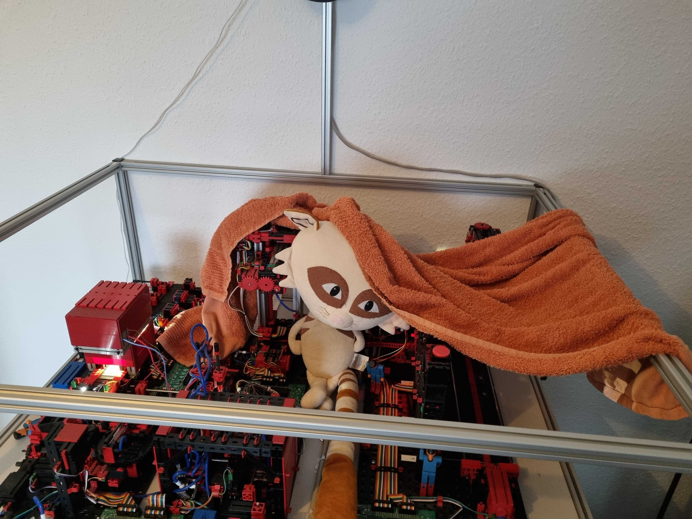
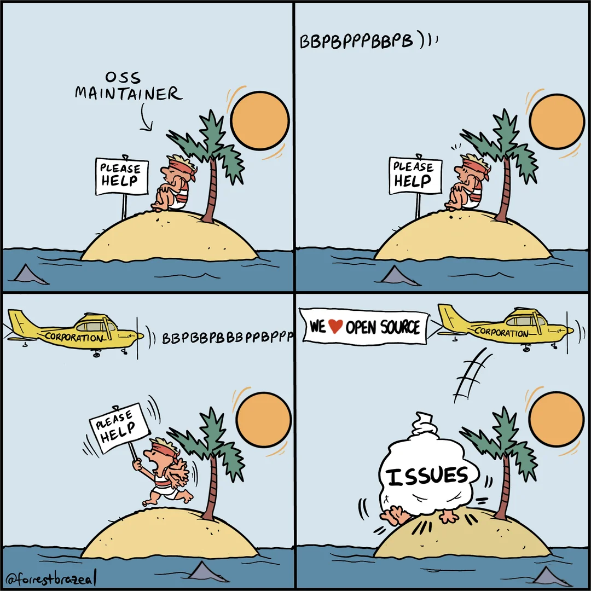

= Throwing the towel

== TL/DR

As I wrote in 2022, in my article https://github.com/chrisdutz/blog/blob/main/plc4x/free-trial-expired.adoc[Your free trial of open-source has expired], I have stopped providing free community support in my free time.

I didn't stop working on features, new drivers, doing the house-keeping and mentoring possible new contributors.

However, I had to do this in my free time, and I am feeling how it's burning me out.
So, I've decided to stop working on PLC4X completely in my free time.

My current employer grants be 4 hours per week, and I will use that time to continue working on PLC4X, but this will limit my involvement to Friday afternoons.

If the industry needs help or wants anything to happen, they can either do it themselves, find someone who's able and willing to do it for them or hire me via Timecho and pay for development. For small things you can drop me a donation (See list of links at the end of the article).

== What I have to say first

The last time when I posted something about me giving up providing free community support, some news sources picked this up as: The project being terminated.

In order to become a Top-Level-Project at the Apache Software Foundation, a project has to demonstrate that it's not just a one-man-show and that there is a viable community backing the project. This gives users the assurance that any person in that project can throw the towel and still the project can continue.
This also is the case for Apache PLC4X.

I just want to point out that everything I'm going to write here only has an effect on me and what I do in my free time. If that will have a long-term effect the project, only time will tell.

== Long Version

For the last more than 8 years I have been investing all time I could into Apache PLC4X.

We're not talking about investing 1-2 hours a week or just some work time.
I was constantly working 60-80 hours per week.

During my time at codecentric I was able to invest all of my work time. Unfortunately, the amount of work-time that I could invest after leaving varied between no-time at all and all the time needed to implement features the company needed.
Now I currently get 4 hours per week.
Everything beyond that (20-40 hours per week), I took from my private life, cutting short on meeting with friends and spending time with my loved ones or simply relaxing and having a good time.

This workload has been draining my energy, and I'm more and more feeling the consequences.

== Covid and it's aftermath

PLC4X' community was really healthy after graduation in 2019.
There were many people working on the various parts of the project.
For any part of the project there were always multiple people able and willing to take on anything.

However, when Covid hit us, many of the contributors grew more and more dormant.
Some had to fight to keep the lights on in their own businesses and simply didn't have any more time or energy to spare.
Others simply changed jobs to positions that no longer required PLC4X.
Due to budget cuts, I could no longer continue to work on PLC4X as part of my job at codecentric.
Getting new folks on board during that time was also super challenging.

Right now I would count 4-5 of the core team still actively working on various parts of the project.
However, it seems we have lost everyone besides me, who was working on the house-keeping of the project.

An open source project is more than implementing features.
Bill Doerrfeld writes in his recently published blog-post (https://thenewstack.io/open-source-is-at-a-crossroads/): "People also don’t often realize that community management for open source projects is a full-time job"

There usually is a lot of work in cleaning up, refactoring, streamlining, optimizing, testing, documenting, writing reports and mentoring and encouraging others to become part of the team.
I see mentoring as the probably most important job of them all.
Unfortunately also the one that requires the largest investment in time.

After announcing that I would stop providing free commercial support for PLC4X in 2022, I focussed on encouraging people to scratch their own itches.
Obviously, this took even more time than simply fixing things myself.
But I still didn't grow tired of trying to encourage people to start working on PLC4X themselves by promising to be there to help, if they need any help and by even providing them with the steps needed to do so.
My hope was, once they got more confident with scratching their own itches, they would not only do the work for these, but also start working on other people's itches as well, as this is the typical way people grow into open-source.

Needless to say, not much came out of this ... usually people disappeared as fast as they'd shown up.
Some even closed their issues with snarky comments such as: "giving up on this lib using lib X now".
Probably `lib X` is also full of similar comments in their bug and issue tracker ;-)

But still there were enough issues remaining to cause quite a wall of issues forming, one I recently decided to squash, fixing more than half of the open issues within 2-3 weeks.

This was all work that I have been continuing to do mostly in my free time.

== Promises

As I mentioned before, I left codecentric in 2020, since I was no longer allowed to work on PLC4X in my work time due to covid-related budget cuts.
I decided to stick with PLC4X and looked for a position where I could continue to work on it.

During my time at Mapped, I was able to invest a lot of time into PLC4X, especially the `Go` implementation: `PLC4Go`, however the house-keeping was to be done in my free time.

Despite the completely different promises made by the company I worked for after that, I had to do everything in my free time.
At least here, I learned the hard way, that I should never blindly trust someone wanting to hire me.
I now expect things to be written into the working contract before signing it.
No more "These are just a formalities, and we'll sort them out quickly once you've joined the team".

At Timecho I now have 4 hours per week (Friday afternoon) to work on PLC4X.
Most of my work-time now goes into Apache IoTDB.

I invested all of my energy in PLC4X for far to long without it ever taking off commercially.
For this, I blame the industry, for which this project was created, that has yet to understand the concept of open-source: It's about the sharing, not about the taking

Open-Source is a model for collaborating, providing the common grounds for even the greatest competitors to work on something together, that none of them could do alone.
A form of collaboration where the common need outweighs their differences and allows the creation of something that isn't core to either of their businesses.

I tried everything: Offering Consulting, GitHub Sponsors, Crowdfunding.

With GitHub Sponsors, I got in total 150€ in sponsorship from a friend of mine, but that was it.
The crowdfunding project that I set up with my company didn't even get a single cent invested.
My buymeacoffe.com page (https://buymeacoffee.com/christoferu) got exactly one donation from a former colleague of mine (thanks for that, by the way ... but admittedly I think I also got myself a beer or two ;-) )

== Is it worth it?

I started reflecting on what I managed to achieve so far and if it's worth continuing.

Even if every POC I did was a huge success, and I was usually able to greatly outperform the industry standard.
Still only one resulted in a real gig.
Unfortunately in the automation space, small companies and open-source projects can't compete with the marketing and sales departments of the major automation-vendors.

The list of the stuff I was able to achieve before joining Timecho was small:

- In Switzerland there were sensors in the highways all over the country, but there were no communication-drivers to collect that sensor data. Thanks to a little PLC4X driver that I built, now this data is collected and used to steer and guide traffic all over Switzerland.

In the first half year after I joined Timecho, quite a number of great things have been added to that list:

- I helped China transition to renewable energy by providing the Apache PLC4X driver needed to communicate with a distributed network of backup gas turbines, that are distributed throughout the country, prepared to jump in, if there's no wind, the sun isn't shining and the hydro-energy is running low because of too little rain. Selling the benefits of renewable energy to the population and industry doesn't work well if the lights go out because the renewable energy sources are taking a day off.
- Help people in hospitals, for which they now are able to collect and process data-steams generated by medical monitoring equipment and spot anomalies a lot more reliably and faster than any human could - Sort of `predictive-maintenance for humans`: Saving lives.

If I try to list up all the good I was able to do in Germany:

- One company in Germany now uses one Laser Printer less (I hope)

(No, the list is indeed complete ... in 8 years of effort I couldn't achieve more in my home country)

I know that the stuff we have been building is being used elsewhere: from Home-automation to steel melting plants, car manufacturers, pharmaceutical companies even companies producing jet engines.
But as nobody is talking about anything publicly, I simply don't know details or am not allowed to talk about them.

But it seems others are gladly adopting PLC4X.

Some examples:

AWS is using PLC4X for their shop floor connectivity thing:
- https://aws.amazon.com/de/blogs/industries/collecting-data-from-industrial-devices-to-aws-services/
- https://github.com/aws-samples/shopfloor-connectivity/tree/mainline/adapters/s7

HiveMQ is using PLC4X as core part of their open-sourced HiveMQ Edge product:
- https://www.hivemq.com/products/hivemq-edge/
- https://github.com/hivemq/hivemq-edge/tree/master/modules/hivemq-edge-module-plc4x

These are just some examples that I could publicly find, and I've seen even more examples, where companies simply take our libraries, pack them in their products and sell them, using our community for providing support for their products.

Lately, I've simply been completely burning out.
The huge pile of work, combined with the lack of reward for doing it, was simply too much for me.
I used to stay up long and even developed a sort of hate towards my bed, although I was too tired to stand.
When I finally lay down I usually woke up 4 hours later, no matter how much I wished and needed to sleep longer.
In the early morning I then finally give in and get up to start working again – almost thankful for being able to stop trying.

== My solution

So I have decided and already announced in the project, that end of March 2024 I have stopped working on the project in my free time completely if I'm not compensated for it.

As a direct result of this decision I recently received two donation with an ask for help and I was happy to be of assistance.
I believe this transaction was beneficial for me and them.

I have set up a private repo, where I'm doing work on stuff that I need or simply want to do.
Right now it contains a completely rewritten version of an Allen Bradley Logix driver, that in contrast to the PLC4X-version supports auto-discovery, browsing and reading and writing of user-defined types.
Also will all work on the UI client for PLC4X, that I already started, be done in that repo.

I plan on donating these things and more to the open-source project eventually but on my own terms.
If you're interested in any of these future features sooner than later, you may consider offering a donation.
I'm happy to change my schedule in exchange for generosity.

I might continue to address things in the open-source project in my free time in the future, but these will only be because I'm using PLC4X in my home automation system or possibly someone dropped a larger donation.
Anything beyond my previously mentioned 4 hours per week is now history.

An Apache project usually is not a one-man-show.
The project will definitely continue, however at a much slower pace.

== The Future of Apache PLC4X

Things will probably change.

Perhaps me stepping back gives room for people that might have been kept from participating due to my over-proportional involvement.
After all, when the bases are covered by someone, and you only have to wait for a fix, why bother investigating yourself?
If that's the case, then things will normalize again.

On the flip-side, if this doesn't happen, there also is a chance that quite the opposite could be the case.
When there is nobody around to take care of the annoying house-work, and therefore not being able to concentrate on the fun parts, hat could also drive people away.

In the case that community involvement dries up even more, Apache PLC4X could be heading for the Apache Attic.
This is the place where all Apache projects go, once the community surrounding it is no longer able or willing to provide the amount of support that's expected of it.

I will continue to invest my free time into open-source.
However, just in projects that I believe have a sustainable future or just for fun.

Even if I have completely lost my faith in open-source in the OT-industry, I still have faith in open-source in general.

== Glimpse into the future

There's something big lurking around the corner, that will become an issue soon and which could speed up things.

Once in Europe the CRA (Cyber-Resiliency-Act) and PLD (Product Liability Directive) are becoming binding legal frameworks and probably also similar initiatives elsewhere, I expect the `house-keeping` in projects such as Apache PLC4X to skyrocket.
A very long list of rules will apply to how software is to be created and maintained and released and this list doesn't really make a difference between commercial offerings and open-source projects.
As soon as a `product with digital elements` (Which software is generally referred to here) is to be `put on the market` (releasing the software), the entity releasing the software is responsible to complying with these rules. If they don't they will be liable for any damages caused by using their software.

Luckily an initial pushback by commercial and non-commercial entities here in Europe have made the officials define a so-called `open-source steward` as fourth type of player on the field (Next to: "private", "commercial", "governmental").
The Apache Software Foundation as well as the Eclipse Foundation will most probably be treated as such.
However, a vast majority of other open-source foundations and especially the tens of thousands of GitHub projects will not.

Projects being released by an `open-source steward` will only be required to comply with about half of all these rules.
Using software of any vendor that does not have this status will require implementing the full list.

When it comes to using software, there will most probably be three variants:

- Consuming software that complies with the full list of rules will be ok (This usually will be the case for commercial offerings)
- Consuming software that is released by an open-source steward will require following a reduced number of rules
- Consuming software that is not part of any of the two previous groups, will become illegal

So if a customer consumes a product containing software, all rules will have to be applied to that. In case of commercial software being included, the vendor of that software will have done all the work for that part. In case of open-source software provided by an open-source steward, the foundation providing the software will have applied the part of the rules, that apply to it and the company putting it in its product will have had to apply the rest.

Open-source software provided by sources, that are not considered open-source stewards will have to either apply all rules, or be forbidden to release it. I am not 100% sure how this will be enforceable, if an author is located outside the EU, but I would just say, that this is nothing I want to try out. This will make a huge part of existing open-source unavailable to the commercial world - at least within Europe.

Experts are estimating that this will make commercial software in general become 30% more expensive, as the vendors will be charging their customers for the extra work and extra costs. Open-source projects however don't have this option.

Luckily at the ASF we already have a pretty strict set of policies when it comes to releasing software, so we expect the differences for most of our projects to be not that significant. Those parts where changes are needed, we're already working hard on shielding our projects as good as we can, by investing significantly into tooling and infrastructure.

Unfortunately, there will be one group of software, that will most probably still have to comply with a much larger set of rules, even if they are hosted at an open-source seward: Projects that are considered `critical infratstuctue`.
I was told that Apache PLC4X will most probably be considered as such. Releasing critical infrastructure products, will most definitely require checks such as external code audits etc., which don't come for free and are a huge amount of work.

This also brings me back to the topic of this blog post: That PLC4X needs more support by the companies using it.

Without a significant increase in workforce and en even more significant increase in funding, I am pretty sure that nobody currently working on the PLC4X project is willing to continue, once CRA and PLD are in place and their rules become requirements.

Money would definitely be well invested in supporting open-source projects in general, especially those projects that don't have any form of commercial backing. Without significant invests many projects will most probably simply stop existing.

Apache PLC4X is, as far as I know, the only open source project for communication with various types of industrial equipment, which is also hosted by an organization considered an open-source steward.
To my knowledge, the only other project in this sector is the Eclipse Milo project.
However, this project only deals with communication in one single protocol (OPC-UA).

Having a look at other open-source projects in this sector, most are run by individuals in their free time and not backed by a real community.
I see no chance of being able to continue using these in a CRA and PLD regulated world.

Generally: Companies relying on open-source should consider funding both the projects and the foundations of whom they plan consuming open-source products from, now and in the future, or they will have to do all the work themselves. This will come at costs that are a lot higher than simply supporting existing projects. However, this has to happen now and not once it's too late. Once they have given up, they won't be coming back.

I know the ASF is already preparing itself and it's projects and so will the others.
This comes with quite some costs for all of them.
Processes need to be defined or re-defined, new tooling needs to be created, projects need to be trained to follow new processes.
If these additional costs make the foundations run at a deficit for too long, these safe harbours might also disappear.

== Call to action

If you want me to work on anything related to Apache PLC4X, here are two options:

- GitHub Sponsors: https://github.com/sponsors/chrisdutz/
- BuyMeACoffee: https://buymeacoffee.com/christoferu

Also, your company should really consider also supporting the Apache Software Foundation:

- https://www.apache.org/foundation/sponsorship

