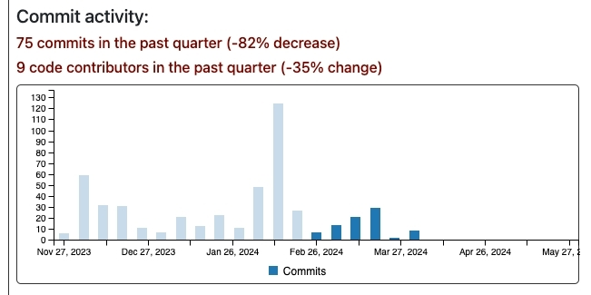

= Throwing the towel

image::toddy-towel.jpg[]

== What I have to say first

In order to become a Top-Level-Project at the Apache Software Foundation, a project has to demonstrate that it's not just a one-man-show.
This also is the case for Apache PLC4X.

As the last time when I posted something about me giving up giving free community support, some news sources picked this up as: The project being terminated.

I just want to point out that everything I'm going to write here only has an effect on me and what I do in my free time. If that has an effect on the project, only time will tell.

== TL/DR

As I wrote in 2022, in my article https://github.com/chrisdutz/blog/blob/main/plc4x/free-trial-expired.adoc[Your free trial of open-source has expired], I have stopped providing free community support in my free time.

In the past I kept on insisting, when taking up a new job, that I am allowed to keep my own business running as a side-business, as I knew, that in order for an open-source project to be successful, there needs to be a place where users can get commercial support.

This changed last year, when I shut down my business. For years there were almost no contracts coming in, and I was in danger of my business being closed by the German tax officials (They don't like companies that run at a deficit for years). However, I continued to work on the house-keeping of Apache PLC4X and trying to keep the community active and encouraging others to scratch their own itches by offering assistance as a mentor.

Despite the promises from my employers to be allowed to work on PLC4X as part of my day-job, after leaving codecentric, never has this promise been kept or the amount of time granted for that was simply not enough to do much.

I compensated this by doing more in my free time and more and more did I notice that I'm burning up.

So I've decided to also stop working on Apache PLC4X in my free time.

Currently, this reduces my involvement in the project to what I have been granted by my current employer, which is 4 hours per week.
So I'm not giving up completely, just reducing my involvement to an absolute minimum.

If the industry needs help or wants anything to happen, they can either do it themselves, find someone who's able and willing to do it for them or hire me via Timecho and pay for development or - for smaller things - drop me a donation.

Work on new features or drivers by me will probably continue.
However, I'll do this in private closed-source repositories.
I will only donate parts of that after receiving not insignificant donations from the industry as compensation of my time.

*Don't expect anything to happen on my side for free anymore*

== Long Version

For the last more than 8 years I have been investing all of my time into Apache PLC4X.

I'm not talking about investing 1-2 hours a week or my work time.
I was constantly working 60-80 hours per week for the last 8 years.
20-40 hours per week I took from my personal private life, cutting short on meeting with friends and spending time with my loved ones or simply relaxing and having a good time.

This workload is draining my energy, and I'm more and more feeling the consequences.

=== Covid and it's aftermath

PLC4X' community was really healthy after graduation.
When Covid hit us however, many of the contributors grew more and more dormant.
Some had to fight to keep the lights on in their own businesses, some changed jobs to positions that no longer required PLC4X.
Also, I could no longer work on PLC4X as part of my job, as budgets were being tightened.
On the other side, getting new folks on board during that time was super challenging.

Right now I would generally count 4-5 of the initial core team still working on the project.
However, it seems we have lost everyone working on the base house-keeping of the project.

An open source project is more than implementing features.
Bill Doerrfeld writes in his recently published blog-post (https://thenewstack.io/open-source-is-at-a-crossroads/): "People also don’t often realize that community management for open source projects is a full-time job"

There usually is a lot of work in cleaning up, refactoring, streamlining, optimizing, testing, writing reports and probably the most important thing for an Apache project: mentoring and encouraging others to become part of the team.
This I see as the probably most important job of them all.
Unfortunately also the one that requires the largest investment in time.

After announcing that I would stop providing free commercial support for PLC4X, I had focussed on encouraging people to scratch their own itches.
This usually even took more time than simply fixing it myself.
But I still didn't grow tired of trying to encourage people to start working on PLC4X themselves by promising to be there to help, if they need any help and by even providing them with the steps needed to do so.

Needless to say, that not much came out of this ... usually people just disappeared as fast as they'd shown up.

Unfortunately this caused quite a wall of issues forming, one I recently decided to squash, fixing 50% of the open issues within 2-3 weeks.

=== Promises

This was all work that I have been continuing to do mostly in my free time.

During my time at Mapped, I was able to invest a lot of time into `PLC4Go`, however the house-keeping was to be done in my free time.

The company I worked for after that, I had to do everything in my free time, despite the completely different promises I was made in order to make me take the job.

At Timecho I now have 4 hours per week (Friday afternoon) to work on PLC4X.

For far too long have I been investing all of my energy in PLC4X: A project that has never really taken off commercially, as the industry to which this project is aimed, hasn't understood the concept of open-source.

It's not about the taking it's about the sharing.

It's a model for collaborating, providing the common grounds for even competitors to work on something together which all need, but nobody could implement on their own, but which is not the core product of any of them.

I tried everything: Offering Consulting, GitHub Sponsors, Crowdfunding.

With GitHub Sponsors, I got in total 150€ in sponsorship from a friend of mine, but that was it till about a month ago.
The crowdfunding project that I set up with my company didn't even get a single cent of donations.
My buymeacoffe.com page (https://buymeacoffee.com/christoferu) got exactly one donation from a former colleague of mine from codecentric (thanks for that, by the way ... but admittedly I think I also got myself a beer or two ;-) )

I started reflecting on what I managed to achieve so far and if it's worth continuing.

Even if every POC project I did was a huge success, almost none resulted in real gigs as an open-source project usually can't compete with the marketing and sales departments of the major OT-vendors.

The list of the stuff I was able to achieve before joining Timecho was small:

- In Switzerland there were sensors in the highways all over the country, but there were no drivers to collect that sensor data. Thanks to a little PLC4X driver that I built, now this data is collected and used to steer and guide traffic all over Switzerland.

Since then, quite a number of great things have been added to that list:

- Despite how it might sound: I helped China transition to renewable energy by providing the Apache PLC4X driver needed to communicate with a distributed network of reserve gas turbines, that are distributed throughout the country, prepared to jump in, if there's no wind, the sun isn't shining and the hydro-energy is running low because of too little rain.
- Help people in hospitals, for which they now are able to collect and process data-steams generated by medical monitoring equipment and spot anomalies a lot more reliably and faster than any human could - Sort of `predictive-maintenance for humans`: Saving lives.

If I try to list up all the good I was able to do in Germany:

- One company in Germany now uses one Laser Printer less (I hope)

(No the list was not corrupted ... in 8 years of effort I couldn't achieve more in my home country)

I know that the stuff we have been building is being used elsewhere: from Home-automation, over steel melting plants, car manufacturers, pharmaceutical companies right up to companies producing jet engines, but as nobody is talking about anything publicly, I simply don't know details and I definitely sometimes I'm just not allowed to tell you about it.

But it seems others are gladly adopting PLC4X.

Some examples:

AWS is using PLC4X for their shop floor connectivity thing:
- https://aws.amazon.com/de/blogs/industries/collecting-data-from-industrial-devices-to-aws-services/
- https://github.com/aws-samples/shopfloor-connectivity/tree/mainline/adapters/s7

HiveMQ is using PLC4X as core part of their open-sourced HiveMQ Edge product:
- https://www.hivemq.com/products/hivemq-edge/
- https://github.com/hivemq/hivemq-edge/tree/master/modules/hivemq-edge-module-plc4x

These are just some examples that I could publicly find, and I've seen even more examples, where companies simply take our libraries, pack them in their products and sell them.

image::open-source-commic.webp[]

People from the Inductive-Automation forums have been begging me to create an Ignition adapter for PLC4X as we support many of the protocols that people there are missing.

Especially the Beckhoff ADS protocol seems to be on the wish-list for quite a long time.

However, have I decided that I will not do this.
If I would, I would only do it as a commercial product and in order to do that I would need to register a company here in Germany.
After I gave up my 24-year-long running business end of 2022, I am definitely not going to register a new company in the pure hope that someone might purchase anything, even if they promised too. I have come to learn that promises in the OT world are worth nothing.

Lately, I've simply been completely burning up.

The huge pile of work, combined with the lack of reward for doing it, was simply too much for me.

It's the type of burning up, where you stay up long as you've developed a sort of hate towards your bed, even if you're almost too tired to stand.
But after giving up and giving sleep a try, you still wake up 4h later, no matter how tired you are, and you give up on trying to sleep when it's time to start working - almost being thankful that you've now got a reason to stop trying to.

=== My solution

So I have decided and already announced in the project, that end of March 2024 I have stopped working on the project in my free time completely if I'm not compensated for it.

2 donations I got recently were a direct result of me telling the people asking for help, that this is the way they are getting support from my side and I think both are quite happy with what they got.

I have set up a private repo of my own, where I'm doing work on stuff that I need or simply want to do.
Right now it contains a completely rewritten version of an Allen Bradley Logix driver that in contrast to the PLC4X-version supports auto-discovery, browsing and reading and writing of user-defined types.
Also will all work on the UI client for PLC4X, that I already started in that repo.

Things I implement there I do plan on donating to the open-source project, however I will only do that if I receive not insignificant amount of money with donations.
As I don't run a company I can't sell anything.
I know this is not the way the industry operates, but to be frank: I no longer care ... if they want my stuff now they need to abide to my rules.

I might continue to address things in the open-source project in my free time in the future, but these will only be because I'm using PLC4X in my home automation system or possibly someone dropped a larger donation in https://github.com/sponsors/chrisdutz/[GitHub Sponsors] or https://buymeacoffee.com/christoferu[BuyMeACoffee] accounts.
Anything beyond my previously mentioned 4 hours per week is now history.

An Apache project usually is not a one-man-show. The project will definitely continue, however at a much slower pace (as you can probably see in the following commit statistic screenshot).

=== The Future of Apache PLC4X

This might change, as possibly me stepping back makes room for people that might have been kept from participating due to my over-proportional involvement.

If that's the case, then things will normalize again.

If however this doesn't happen, there also is a chance that the opposite could happen.
Having nobody take care of the annoying house-work, and therefore not being able to concentrate on the fun parts, could also drive people away.

In the case that community involvement dries up even more, there is a not slim chance, that Apache PLC4X could be aimed at the Apache Attic.
This is the place where all Apache projects go, once the community around an Apache project is not able or no longer willing to provide the amount of support that's expected of it.

I will continue to invest my free time into open-source. However, just in projects that I believe have a sustainable future or just for fun for other projects which I have some other strange form of affection for.

Even if I have completely lost my faith in open-source in the OT-industry, I still believe in open-source in general.

=== Glimpse into the future

There's something big lurking around the corner, that might become an issue soon and which could speed up some things.

Once the CRA and PLD initiatives are becoming binding legal frameworks in europe and probably also similar initiatives elsewhere, I expect the `house-keeping` in projects such as Apache PLC4X to skyrocket.

If there's nobody willing or able to do that, that's going to create facts a lot quicker than most people will expect.

Even if public money would definitely be well invested in supporting open-source projects in general. Especially those that don't have any form of commercial backing, as most of these will not have the power to prepare for these legal changes.
I see no way around significant invests by entities such as the European Union in order to keep the lights on in these projects.

One thing people relying on open-source should generally consider: Using an open-source project in the EU which is hosted at an organisation which is considered an  `open-source steward` will reduce the amount of hoops they need to jump through in order to sell their products significantly, once CRA and PLD are in place.

Using projects that are not maintained by an open-source steward or implementing things themselves will require jumping through the complete list of hoops (That's a hell of a lot of hoops).

=== Links

- GitHub Sponsors: https://github.com/sponsors/chrisdutz/
- BuyMeACoffee: https://buymeacoffee.com/christoferu